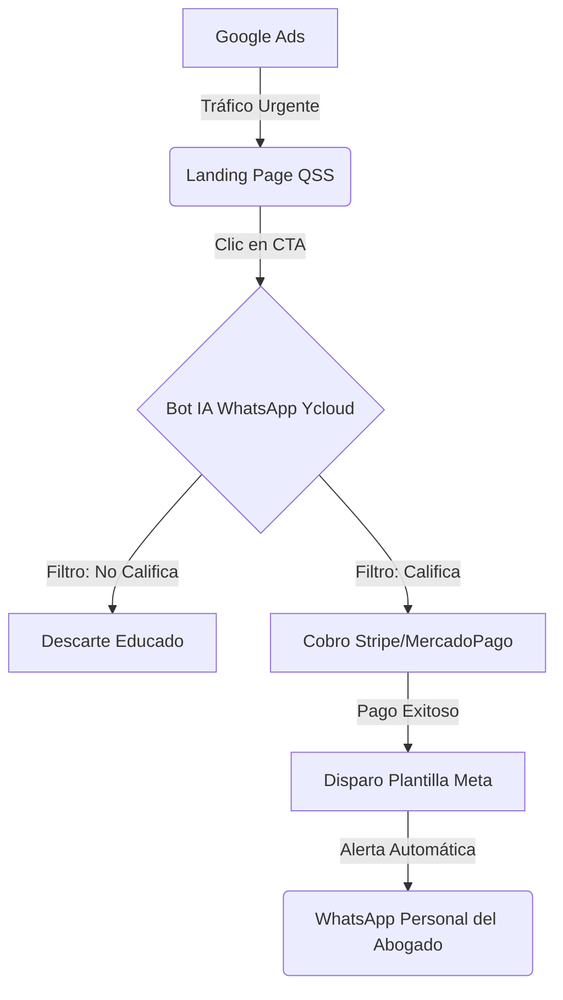

# QSS - Manual Operativo Maestro (M&A-Ready Playbook)

Bienvenido al "Data Room" operativo de **QSS (Quant Sales System)**. 
Esta documentación contiene los Standard Operating Procedures (SOPs) que gobiernan el ciclo de vida completo de la agencia. 

Están diseñados bajo el estándar **"Living Playbook"**, lo que significa que están estructurados para escalar, delegarse inmediatamente, y superar cualquier proceso de auditoría de *Due Diligence* en caso de fusión o adquisición (M&A).

## Resumen Ejecutivo del Producto (El Embudo QSS)

QSS provee infraestructura "Done-For-You" para Abogados Penalistas compuesta por un embudo de 4 etapas enfocado exclusivamente en entregar casos de alto valor (High-Ticket) con cero fricción para el abogado.

## Índice de Procedimientos (SOPs)

### 1. Adquisición y Ventas
- [SOP-001: Prospección y Filtrado Inicial](01_acquisition/SOP_01_prospeccion_y_filtrado.md)
- [SOP-002: Discovery Call y Cierre de Ventas](01_acquisition/SOP_02_ventas_y_cierre.md)

### 2. Onboarding del Cliente
- [SOP-003: Preparación Pre-Onboarding (Checklist)](02_onboarding/SOP_03_pre_onboarding.md)
- [SOP-004: "White-Glove" Onboarding Meet](02_onboarding/SOP_04_onboarding_meet.md)

### 3. Ingeniería y Despliegue Técnico
- [SOP-005: Despliegue Técnico y Configuración](03_engineering/SOP_05_tech_setup.md)
- [SOP-006: Pruebas y Encendido de Campañas (Go-Live)](03_engineering/SOP_06_go_live.md)

### 4. Éxito del Cliente y Finanzas
- [SOP-007: Mantenimiento y Troubleshooting](04_success_billing/SOP_07_mantenimiento.md)
- [SOP-008: Facturación, Cobros y Bajas (Churn)](04_success_billing/SOP_08_facturacion.md)

---
*Este documento es propiedad confidencial de QSS. Toda modificación a los SOPs debe ser aprobada por el COO o Founder.*
